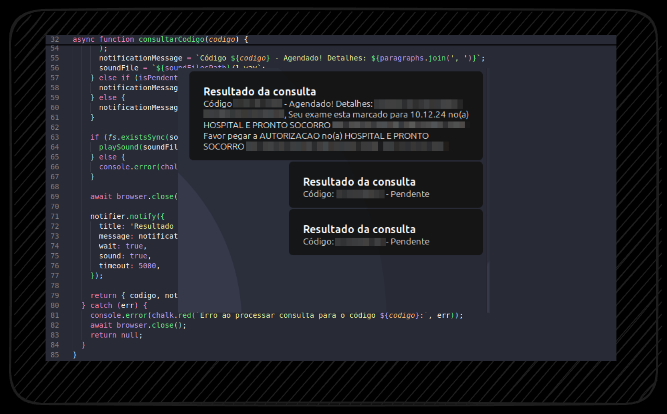

# Consulta SISREG-AM

> [!WARNING]
> O HTML do site foi alterado, portanto o scraping precisa ser atualizado.

> [!NOTE]
> Este projeto foi desenvolvido para facilitar o acompanhamento de exames agendadas no sistema **SISREG** na cidade de Manaus.

## Demo



## O que o script faz?

> Diariamente, através de um agendador de tarefas como o crontab, o script acessa o site do SISREG para verificar o status dos exames.

- Envia uma notificação no desktop.
- Toca um som personalizado.
- Mantém a notificação ativa até que você a visualize.

## Como usar?

### Requisitos:

- [Node.js](https://nodejs.org) instalado no seu computador.
- Crie um arquivo `.env` contendo as variáveis de ambiente personalizadas. Essas variáveis configuram os parâmetros necessários para o funcionamento do script, como os códigos dos exames, a unidade de atendimento, o local do arquivo `.env` e o diretório onde os arquivos de som estão armazenados.

### Exemplo de arquivo `.env`:

```bash
CODES=123456789,987654321
ATTENDING_UNIT="HOSPITAL EXEMPLO"
SOUND_FILES_PATH="/home/usuario/Documentos/consulta-sisreg-am/sounds"
ENV_PATH="/home/usuario/Documentos/consulta-sisreg-am/.env"
```

### O que cada variável faz:

- **CODES:** Aqui você coloca os códigos dos exames ou consultas que quer monitorar. Exemplo: 123456789,987654321 (separados por vírgula).
- **ATTENDING_UNIT:** Nome da unidade de atendimento onde você está fazendo o exame, como "HOSPITAL EXEMPLO". Isso ajuda a selecionar automaticamente a unidade correta no site.
- **SOUND_FILES_PATH:** Caminho onde você armazenará os arquivos de som que serão tocados quando houver uma notificação. Exemplo: /home/usuario/Documentos/consulta-sisreg/sounds.
- **ENV_PATH:** Caminho absoluto para o arquivo .env. Exemplo: `/home/usuario/Documentos/consulta-sisreg/.env`.

### Como rodar o script

1. Clone o repositório
```bash
git clone https://github.com/aglairvta/consulta-sisreg-am.git
```
2. Entre na pasta do projeto
```bash
cd consulta-sisreg
```
3. Instale as dependências
```bash
npm install
```
4. Crie e configure o arquivo `.env`, como dito acima
5. Execute o script
```bash
npm start
```
## Automatização com crontab [Linux]

> Para garantir que o script execute automaticamente todos os dias, você pode configurá-lo no crontab. Vamos automatizar de exemplo para rodar todos os dias, às 20:30.

1. Torne o script executável
```bash
sudo chmod +x sisreg.js
```
2. Inicie o crontab
```bash
crontab -e
```
3. Adicione seu horário e local do script no fim do arquivo
```bash
##SISREG
30 20 * * * DISPLAY=:0 /usr/bin/node local-onde-baixou-o-sisreg.js
```
